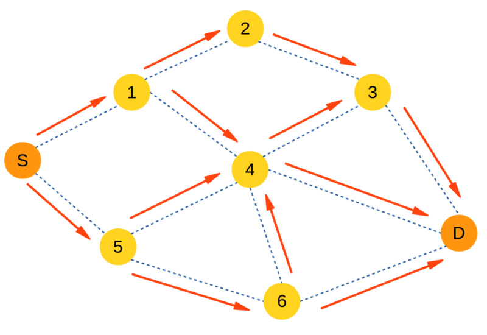

# RLRP ad hoc routing protocol
> Reinforcement Learning based routing protocol implementation
> for wireless ad hoc networks.

This is an implementation of ad hoc routing in wireless networks, based
on one of the concepts of machine learning theory - Reinforcement Learning.
The main idea of this approach is to make a decision about forwarding a
packet with a certain destination address to a neighboring node based on
current estimation values of a given set of neighbors. The estimation
values are being dynamically changed by means of so-called "rewards", which
represent feedback values for the chosen "action" - a packet forward event
to a selected neighbor.

This routing protocol works on Linux-based machines with TCP/IP stack, and
provides the routing functionality for any data packets with either IPv4 or
IPv6 addressing. The other L3 protocols are unsupported for now. The routing
process starts after initializing the routing daemon (adhocd), and runs on
a created virtual tun-interface (adhoc0, by default), which is "tied up" with
a real network interface of a node used for actual data transmission -
e.g., wlan0, bt0, eth0, and so on.




## Installation

The program works on Linux only, for now.

Clone the repository:

```sh
git clone <github repo url>
```

Rename the cloned directory to ``adhoc_routing``:
```
mv <cloned repo name> adhoc_routing
```

Copy the directory into ``/usr/share/`` folder:

```sh
sudo cp -r adhoc_routing /usr/share/
```

Edit ``conf.py`` file and set your wireless interface name and so on.

Now, you can run the routing daemon by directly executing ``adhocd`` script:
```
sudo ./adhocd start|stop|restart
```

Optional: Add a daemon into linux services (for Ubuntu 16.04):

```sh
cd /etc/init.d/
sudo ln -s /usr/share/adhoc_routing/adhocd
sudo systemctl daemon-reload
```
Now, you can manage the daemon using ``service`` command:
```
sudo service adhocd start|stop|restart|status
```

Log files default location: ``/var/log/adhoc_routing/``

## Usage example

Let's say, there are two wireless nodes (node1 and node2) running in
wifi ad-hoc mode, which should be connected to each other.

First, make sure that the wireless interface name, which is running in
wi-fi ad-hoc mode, is correctly set up in ``conf.py`` file.

Second, run the routing daemon:
```
sudo service adhocd restart
```
In the network interfaces list, there should a virtual ``adhoc0`` interface
appear.

Third, set up some IPv4 or IPv6 addressing on ``adhoc0`` interface:
E.g., node1:
```
sudo ifconfig adhoc0 10.0.0.1/24
```
On node2:
```
sudo ifconfig adhoc0 10.0.0.2/24
```

Fourth, check the connectivity with ``ping``, ``ssh`` or anything. E.g., from node1:
```
ping 10.0.0.2
```
And see the output.

Of course, this example is the most primitive one, which does not really
show the routing process in full action. But this is the basis where a
more complex wireless ad hoc networks can be built on, with tens or
hundreds of such nodes.

Wi-fi ad-hoc mode has been chosen here as the most transparent example,
since linux kernel has good support of wifi ad-hoc for many wi-fi
chips, so the example above can be easily replicated. Certainly, there
are other variants possible, such as: PLC, wired ethernet or
802.15.4 + 6LowPan.

## Development setup

The application is written on Python 2.7 without any usage of external
libraries - so, the only thing which should be installed in order to run
and develop the app - is Python with 2.7.x version with standard
libraries set.

Some libraries which the app uses:
``sys, os, socket, ctypes, struct, logging, threading, fcntl, Queue, hashlib``.

## Meta

Dmitrii Dugaev – [@linkedin](https://www.linkedin.com/in/ddugaev) – dugdmitry@gmail.com

Distributed under the Apache 2.0 license. See ``LICENSE`` for more information.

[https://github.com/dugdmitry/adhoc_routing](https://github.com/dugdmitry/adhoc_routing)

Doxygen code documentation:
[https://dugdmitry.github.io/adhoc_routing/](https://dugdmitry.github.io/adhoc_routing/)

Wiki page:
[https://github.com/dugdmitry/adhoc_routing/wiki](https://github.com/dugdmitry/adhoc_routing/wiki)
